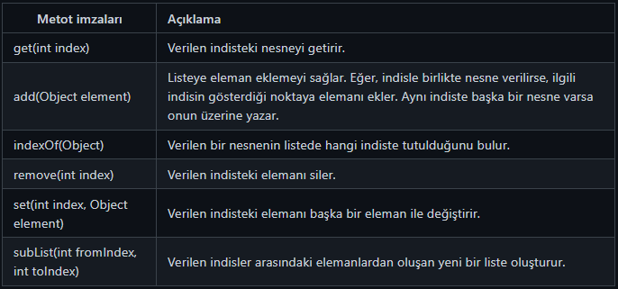

# List interface (Arayüzü)

Collection Interface'ini implemente eden List Interface'i Java 5 ile jenerik (generic) olmuştur. Veriler, geliş sırasına göre (ordered) tutulur.

List'lerin her elemanı bellekte kendine özgü bir alan tutar. List üzerinde veri ekleme ve bu verilere erişme __indis(index)__ denilen __integer__ sayılar üzerinden yapılır. __Başlangıç indisi sıfırdır.__

List Interface'inden kalıtım alan sınıflarda, __tekrarlı (duplicate)__ veya __null__ değerli elemanlar tutulabilir.

Dizilerin kullanıldığı her yerde List'ler kullanılabilirler ayrıca birbirlerine dönüştürülebilirler. Veri işlemeye yarayan metotlarından dolayı List'ler, programcılar, bu yapıları daha çok tercih ederler.

Bu interface'te implemente edilen metotlar;



## List interface’in alt sınıfları

1. __ArrayList__

2. __LinkedList__

3. __Vector__

4. __Stack__

```NOT: Vector ve Stack sınıfları, legacy (miras) sınıflardır. Java 5'ten önceki versiyonlarında var olup, artık daha iyi alternatifleri olan sınıflardır. Hala bu sınıfları kullanan projeler olabileceği için tamamen kaldırılamazlar.```

## ArrayList Sınıfı

List Interface’den türemiş alt sınıf olan ArrayList, liste halindeki verileri dinamik diziler(array) kullanarak saklar. Default boyutu __10__’dur.

Bu dizilere yeni eleman eklendikçe eğer boyutu yetmiyorsa, çalışma zamanında, arka tarafta var olan dizinin boyutunun 2 katı olan yeni dizi tanımlanır. Eski dizideki elemanlar indis değerleri korunarak yeni diziye aktarılırlar. Esnek fakat maliyetli bir collection’dır.

1. __Veri saklamak ve veriye erişimin yoğun olduğu durumlar için ArrayList tercih edilir.__

2. __ArrayList’ler tanımlanırken <>(diamond) operatörleri arasına içerisinde tutulacak değerlerin tipi yazılmalıdır.__

3. __Araya ekleme veya silme işlemleri yapılması durumunda kaydırma işlemleri yapılması gerekir. Bu durum performansı düşürür.__

4. __ArrayList sınıfı thread-safe değildir. Bir ArrayList’e aynı anda birden fazla thread erişebilir. Bu durum veri bütünlüğünü bozar.__


